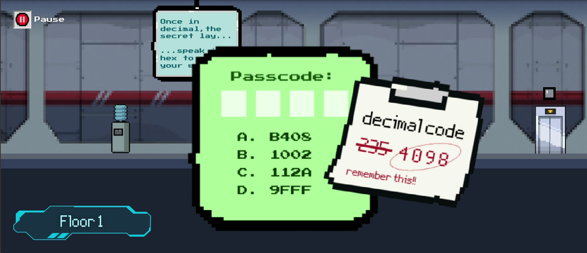
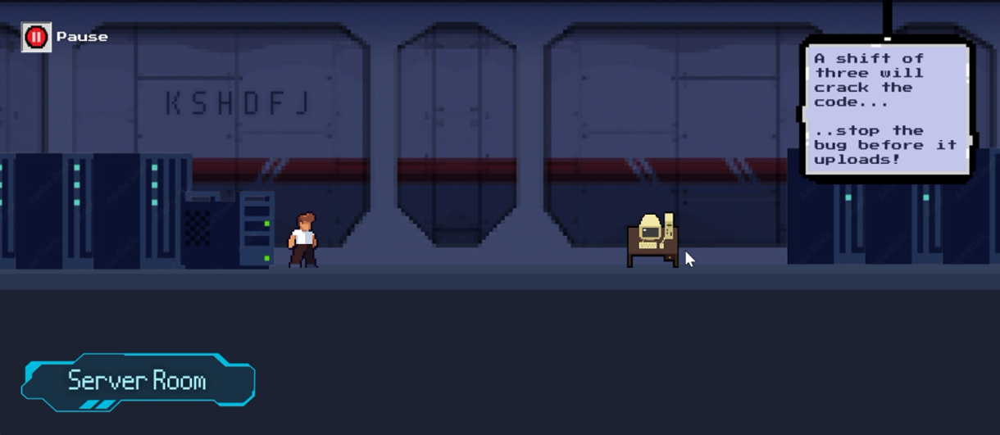
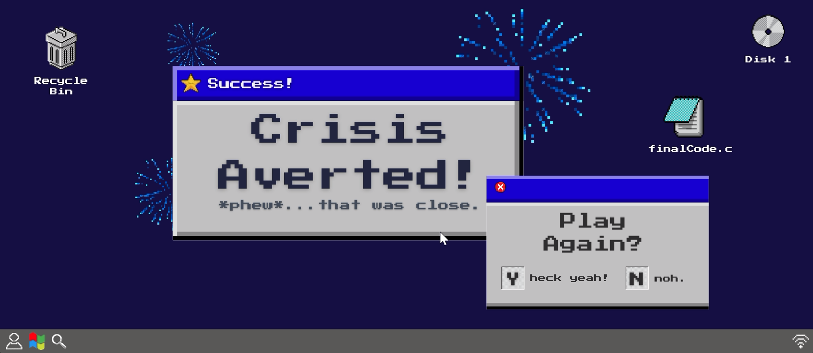

# Error Inbound 👾🎮

### Table of Contents 📑
- About
- How to Play
- Controls 🕹️
- Screenshots 📸
- Future Development Notes 📝

## About
## How to Play
## Controls 🕹️
- ***Left Arrow Key*** - Left Movement
- ***Right Arrow Key*** - Right Movement
- ***Enter*** - Start/Interact with Environment (e.g. door or PC)
- ***P*** - Pause Game
- ***Q*** - Quit Level
- ***R*** - Reset Level

## Screenshots 📸
Here are some screenshots of my game:

## Future Development Notes 📝
