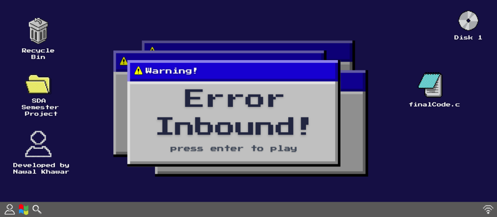
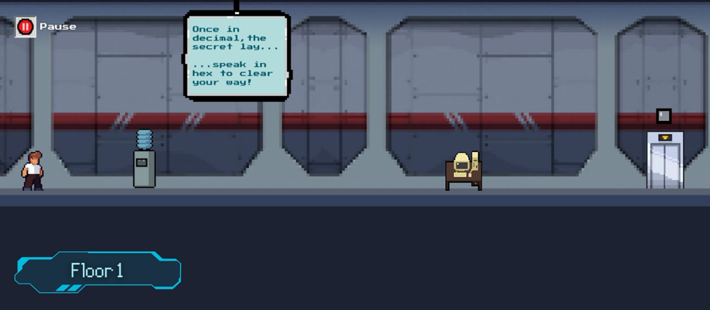
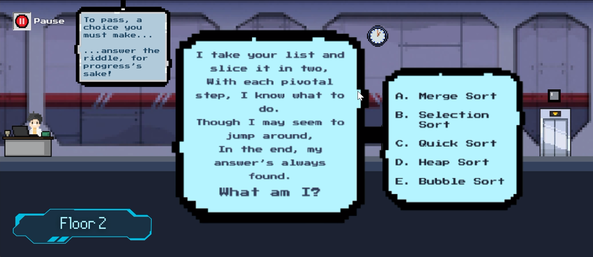
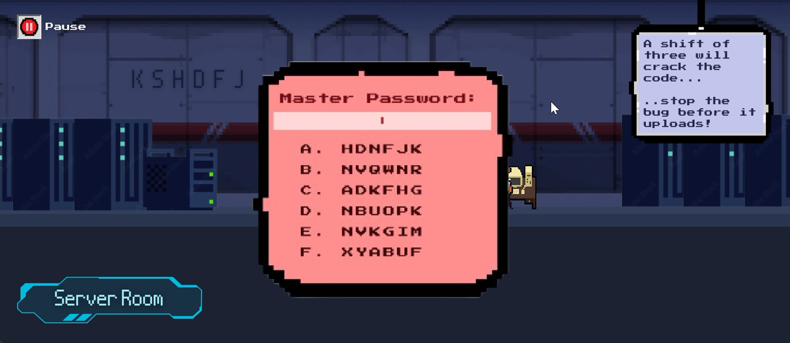

# Error Inbound 👾🎮

### Table of Contents 📑
- About the Project
- About the Game
- Controls 🕹️
- Screenshots 📸
- Future Development Notes 📝

## About the Project
I made this game as part of my semester project for the Software Design & Analysis (CS3004) course. It was our first proper intro to software engineering—everything from SDLC models and design principles to writing clean, maintainable code.
The project involved planning, designing, and building a complete piece of software from scratch while applying what we learned—SOLID principles, design patterns, UML diagrams, object-oriented principles, etc.

I wrote this game in **C++** (in Visual Studio 2022) and used the **Simple & Fast Multimedia Library (SFML)** for graphics rendering.
This game is intended to be a fun way for CS students (and even experts) to apply their knowledge and skills!

## About the Game
Set in a futuristic tech company, you play as a junior software developer tasked with running to the main server room in order to stop a buggy software update from going online and causing disaster. Each floor contains a puzzle based on various CS concepts (like algorithm design, cryptography, binary/hexadecimal conversation), and you need to complete all the levels before the timer runs out!

## Controls 🕹️
- ***Left Arrow Key*** - Left Movement
- ***Right Arrow Key*** - Right Movement
- ***Enter*** - Start/Interact with Environment (e.g. door or PC)
- ***P*** - Pause Game
- ***Q*** - Quit Level
- ***R*** - Reset Level

## Screenshots 📸
Here are some screenshots of my game:

## Future Development Notes 📝
Right now, the game includes 3 levels, each with a puzzle that unlocks the door to the next level. The character can walk around and interact with the environment, and the puzzles are CS-inspired brain teasers.

Originally, I had plans for more complex platformer elements like jumping, running, and multi-step puzzles—but time was short 😅 So that’s definitely on the to-do list for the next version!

Other future plans:
- Complete the central timer mechanic to add a sense of urgency to the game
- Add more levels and puzzle types
- Polish the UI and add animations
- Include dialogue, cutscenes, and a proper story
- Expand platformer mechanics
- Including hint systems so the game becomes accessible to beginners too!

Stay tuned! 🍄🌿
